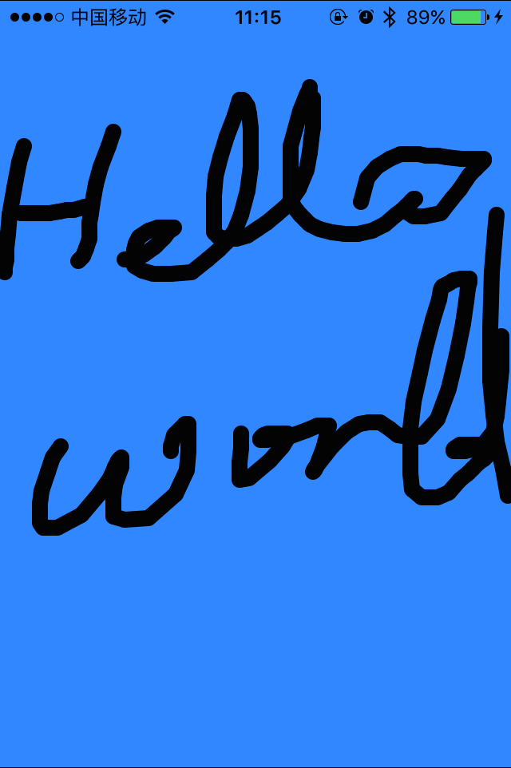

# ProjectDrawChat
项目 画图聊天

#### 说明
画图聊天，一方所画图实时传输到另一个方的界面上。

#### 目录

	iOS
		iOS端
	JavaBackend
		Java写的后端，iOS用TCP链接过来。

#### 感谢
JavaBackend端由[yuercl](https://github.com/yuercl)所写。   
非常感谢。      

#### iOS端效果

